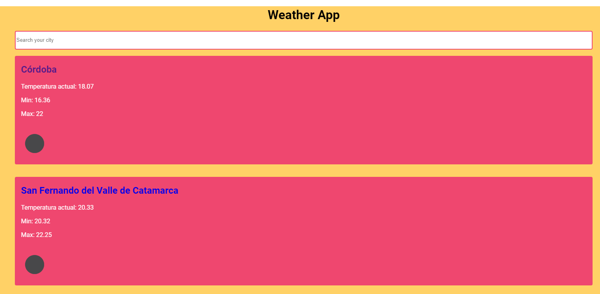
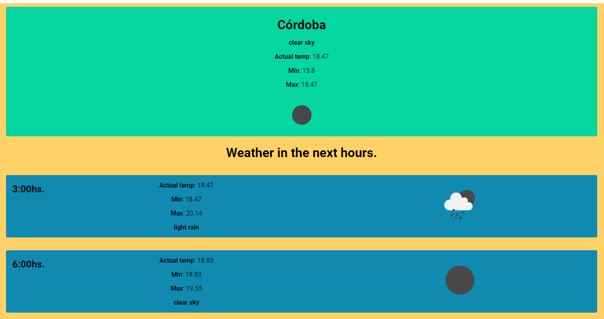

# Weather App
Weather app realizada utilizando Typescript, Next.js, Sass y React. 
Esta aplicación consume datos de la API de [Open Weather] (https://openweathermap.org/api)  
  

[Deploy de la app](https://weather-app-agustinrobledo.vercel.app)
